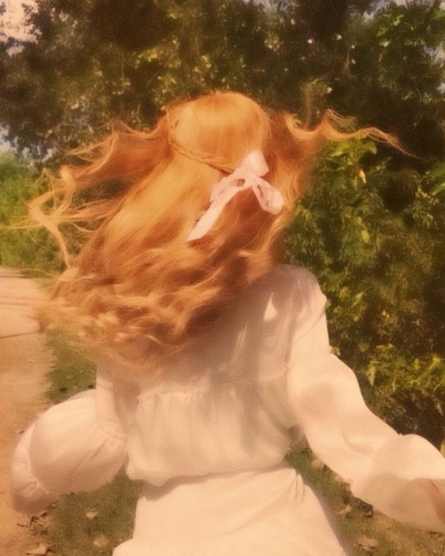

# the first day

I don't know why this is the memory that won't let me go. Out of
everything, out of every minute that came after, out of every second I am in.
The ones that mattered more, the ones that hurt more, it's always this one. 
The field. The wind. Her.

I was seven. It never seemed important. What was important was that she was 
already running before I'd even decided to follow, and my whole body just went. 
No thought. No hesitation. My legs moved like they belonged to her more than me.

God, I can still feel it. The way the tall grass whipped against my
arms, sharp and stinging. The way the air tasted different past that garden wall, 
thicker, sweeter, like breathing in something we weren't allowed to have. 
My chest burning. My heart slamming so hard I thought it might actually give out, 
and some small insane part of me thinking, "if this is how it ends then be it."

She was laughing. Not at me, at everything, at the whole reckless stupid joy of 
being somewhere we shouldn't be. And that laugh did something to me. something that
I didn't have words for yet. It cracked something open in my chest that never 
quite closed back up.

I remember her hair most of all. Marigold in the low sun, that ribbon coming loose 
strand by strand like even it couldn't hold onto her. I remember thinking she 
looked like something that wasn't meant to be caught. Like the running was the 
whole point. Like maybe I wasn't supposed to catch her at all, just keep chasing, 
forever, and be grateful for the privilege of wanting.

I didn't understand yet what I was feeling. I just knew it hurt in a good way, 
an ache I wanted to keep. I know now. God, I know now. It's the same ache. 
It never changed, it just grew.

We collapsed in the grass when neither of us could run anymore. Just
dropped, side by side, staring at the sky and bruised at the edges, both of us 
laughing for no reason except that we were alive and young and hers 
and mine and nobody else's yet.

I didn't know there'd come a day someone would draw a line down the
middle of that field and tell us which side we each belonged to.

I didn't know I'd spend the rest of my life trying to get back across it.

I'd give up everything, everything I have, everything I am, for one
more afternoon of not knowing any of that. Of just running. Of just
being a boy chasing a girl through grass that didn't care who either
of us were supposed to become.

I still hear her laugh sometimes. In the quiet. Right before I fall
asleep. It's the cruelest, kindest sound I know.
