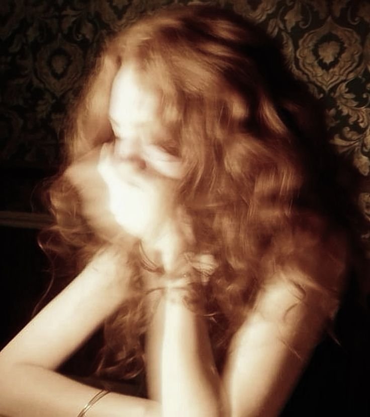

# the tea party that never ended

Everyone else left leaving the atmosphere in silent. I don't know why I stayed. 
I told myself it was the tea, or the fire dying down slow in the grate, or
that I just wasn't tired. None of that was true. I stayed because she stayed, 
and some part of me had already decided I would follow her wherever she lead me, 
without ever admitting it out loud.

We didn't talk about anything important. That's what I remember most, how none 
of it mattered and all of it mattered. She was picking apart a biscuit she never ate, 
laughing at something the Hatter said hours earlier, still turning it over like 
it was fresh. Her hair had come half undone from whatever careful thing it started as. 
She kept tucking it back with one hand, giving up, letting it fall again.

I wasn't a child anymore. Neither was she. Nineteen does something to the way you 
see a person you've known your whole life.Suddenly her laugh wasn't just a sound I liked. 
Suddenly the space between us on that bench felt smaller than it used to, and I was
aware of every inch of it.

She caught me looking. I know she did. She didn't say anything, just
held it a beat too long before glancing back at the fire, and I swear
something passed between us in that silence that neither of us had
the courage to name.

I remember thinking, so this is what it feels like. This exact
moment, low candlelight and her hand pushing her hair back and her
laugh still hanging in the air, this is the moment I stopped being
able to pretend.

I didn't say anything either. I just sat there, memorizing her,
already terrified of how much I wanted to keep this. Keep her. Keep
this feeling that had no business existing between someone like me
and someone like her.

I didn't know yet how much that would cost. I only knew I would have
said it anyway, right then, without hesitation, if she'd asked.

She never asked. She didn't need to. I was already hers before that
night ended. I think I always had been or so I thought..
