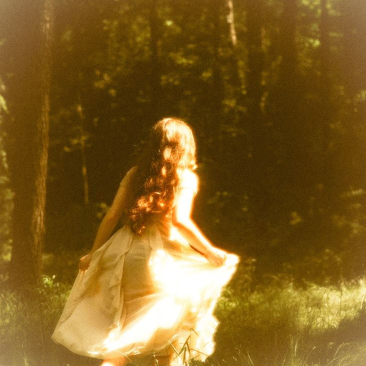

# the night we ran

We shouldn't have gone that far into the woods. We both knew it. That
was probably why we did it anyway.

It started as a dare, or something close to one, her daring me with
just a look, the kind she'd perfected over years of getting exactly
what she wanted without ever having to ask out loud. She took off
running before I even agreed. Like she already knew I'd follow no 
matter what I said.

The trees swallowed the sound of the party behind us. Voices, music,
all of it folding into silence until there was nothing left but her
dress catching gold light through the branches, and my own heartbeat
loud enough to drown out every warning I'd ever been given.

I caught up to her in a clearing, I don't think either of us had seen
before. She was breathless, laughing, hair come completely undone,
and for a second neither of us said anything. We just stood there,
chests heaving, the last of the sun shine orange through the
leaves like the whole forest was on fire just for us.

She looked at me the way she'd never let herself look at me in front
of anyone else. No performance in it. No Queen in it. Just her.

I don't remember which of us moved first. I don't think it matters. I
remember her hands finding mine like they already knew the way. I
remember thinking, this is it, this is the moment I can stop pretend,
I don't want a life I'm not allowed to have.

We didn't say the words. Neither of us needed to. Everything that need 
to be told  passed between us in that clearing without a single sentence
spoken, and for one long  hour we weren't a Jack and a Queen. We
were just two people who'd run far enough into the woods to forget
the rules existed at all.

I have replayed that hour more times than I can count. I know every
second of it by heart. The exact shade of the light. The exact sound
of her breathing slowing down beside me. The exact moment I understood
I would burn my whole life down before I let this be the only time.

I didn't know yet that I wouldn't get the choice.

That the burning could happen both ways.

Just not the way I meant it.
