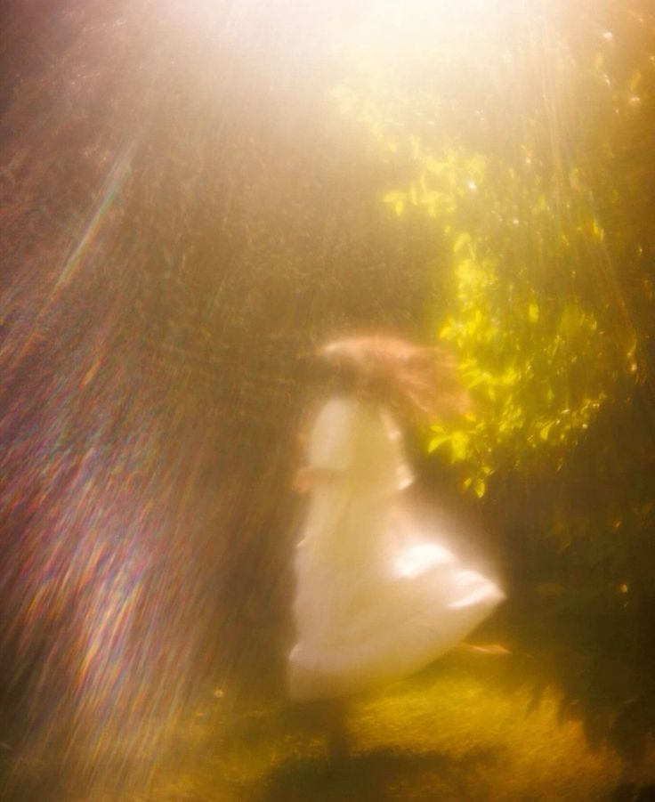

# what she told me

I keep trying to write this one properly and I can't. Every version I
start comes out wrong, too calm, too composed, like I'm describing
something that happened to someone else.

It was raining, I think. Or maybe it wasn't and I've just decided it
should have been, because it feels wrong that the sky did nothing
while my whole world came apart.

She wouldn't look at me while she said it. That's the part I keep
coming back to. Three years of her looking at me like I was the only
steady thing in any room, like I was the one place she never had to
perform, never had to be a Queen or a daughter or anyone's idea of
who she should become. Three years of that look finding me across
crowded gardens and dull ceremonies and rooms full of people who
mattered more than I ever would, and it always finding me anyway,
like it had a memory of its own, like it knew the way.

I used to think that look meant something permanent. Stupid of me,
maybe. But when someone looks at you like that for three years
straight, you start building a whole future out of it without ever
meaning to, brick by brick, day by day, until you don't even notice
you've built a house you were never allowed to live in.

And the one time it mattered most, she looked at the floor.

A marriage. Arranged, of course, it was always going to be arranged,
I don't know why I let myself forget that even for a second. Someone
with a title. Someone that meant something to people. Someone who
decide what's allowed to mean anything at all. Someone who wasn't me.
Could take her away.

I asked when? She told me. "It wasn't far off".

I asked if she wanted it. She didn't answer that one. I watched her 
open her mouth like the word was already there, ready, and then watched 
her close it again, swallowing it back down before it could become real. 
Her hands were shaking.

I almost asked again. I almost begged her to just say one word,
any word, so I could stop drowning in the silence where it should
have been. I didn't. Some silences you learn not to break, because
breaking them means finding out for certain what you already know.

I remember my ears started ringing and I couldn't hear the rest of
what she said properly, just pieces. "Duty." "No choice." "I'm sorry."
"I'm so sorry, Jack."" I'm sorry.""Forgive me."

Sorry. Like that word could hold three years. Like it could hold the
field, the tea party, the woods, all of it, folded down small enough
to fit inside one apology and handed back to me like I was supposed
to just take it and say thank you.

I didn't shout. I didn't beg. I think some part of me had always
known this was coming, the way you know a storm is coming even before
the sky changes color, some pressure in the air that tells you to
brace before you understand why.

She reached for my hand and I let her take it, because even then,
even in the middle of losing her, I couldn't make myself pull away.
That's the part I hate most. That I would have let her break my heart
a hundred more times if it meant she kept holding my hand while she
did it.

I don't remember walking home. I just remember standing in my own
doorway at some point, soaked through, staring at nothing, thinking
one thought over and over until it stopped meaning anything.

She was never really mine to lose. I just spent three years pretending
otherwise, and now I have to spend the rest of my life un-pretending
it, one unbearable day at a time.
